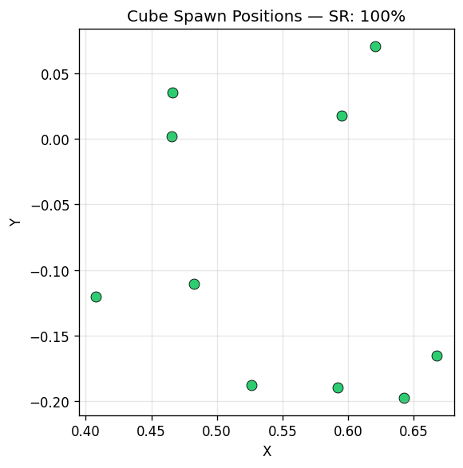

[English](README.md) | [中文](README-cn.md)

# 机器人合成数据生成 Workshop

基于 **AMD GPU (ROCm)** 的机器人操作全流程：**合成数据生成 → VLA 训练 → 仿真评估**。

已在 **CDNA3 (MI300X)** 和 **RDNA4 (Radeon AI PRO R9700)** 上验证。

```
┌──────────────────────────┐     ┌─────────────────────┐     ┌─────────────────────┐
│ 01_gen_data.py (默认场景)  │     │  02_train_vla.py     │     │  03_eval.py          │
│   平面 + 红色方块          │     │                      │     │                      │
│ ─ ─ ─ ─ ─ ─ ─ ─ ─ ─ ─ ─│────▶│  SmolVLA 后训练       │────▶│  闭环仿真评估         │
│ 02_gen_data_custom_scene │     │  基于 LeRobot 数据集   │     │  在 Genesis 中评估     │
│   厨房 GLB + 锚点         │     │  输出 HF checkpoint   │     │  成功率 + 视频         │
└──────────────────────────┘     └─────────────────────┘     └─────────────────────┘
     Franka 7自由度                   lerobot/smolvla_base       渲染 → VLA → PD 控制
     抓取红色方块                      冻结视觉编码器              动作分块预测
     双相机 (俯视 + 侧视)              仅训练 expert + state_proj  随机化方块位置
```

---

## 预生成数据集（快速路径）

HuggingFace 上有一份 100 episode 的平面场景数据集，可以跳过数据生成直接训练：

```bash
pip install lerobot==0.4.4 torchcodec

python scripts/02_train_vla.py \
  --dataset-id lidavidsh/franka-pick-100ep-genesis \
  --n-steps 2000 --batch-size 4 --num-workers 4 \
  --save-dir outputs/smolvla_genesis
```

或在 Python 中直接加载：

```python
from lerobot.datasets.lerobot_dataset import LeRobotDataset

dataset = LeRobotDataset("lidavidsh/franka-pick-100ep-genesis")
print(f"Episodes: {dataset.meta.total_episodes}, Frames: {len(dataset)}")
```

| 项目 | 值 |
|------|-----|
| HuggingFace | [`lidavidsh/franka-pick-100ep-genesis`](https://huggingface.co/datasets/lidavidsh/franka-pick-100ep-genesis) |
| 格式 | LeRobot v3.0，AV1 视频 |
| 集数 / 帧数 | 100 / 13,500 |
| 相机 | 2 路（俯视 + 侧视），640×480 |
| 大小 | ~80 MB |
| 生成环境 | RDNA4 (Radeon AI PRO R9700)，Genesis 0.4.5，seed=42 |

---

## 快速开始（完整流程）

整个 Workshop 通过 `workshop_pipeline.ipynb` 进行，在远端 AMD GPU 节点的 Docker 容器内运行。

Notebook 已内嵌了预生成的可视化图片（`images/` 目录），即使不运行也可以直接阅读理解整个流程。

### 第 1 步 — 登录 GPU 节点

```bash
ssh -A <你的用户名>@<gpu节点>
```

### 第 2 步 — 克隆仓库

```bash
git clone git@github.com:<组织>/Robot_synthetic_data_generation_workshop.git
cd Robot_synthetic_data_generation_workshop
```

### 第 3 步 — 启动 Docker 容器

<details>
<summary><b>CDNA3 (MI300X) — ROCm 6.x</b></summary>

```bash
docker run --rm -it \
  --device=/dev/kfd --device=/dev/dri --group-add video --ipc=host \
  -e PYOPENGL_PLATFORM=egl \
  -e HSA_OVERRIDE_GFX_VERSION=9.4.2 \
  -v $(pwd):/workspace/workshop \
  -v /tmp/workshop_output:/output \
  -v ~/.cache/huggingface:/root/.cache/huggingface \
  -w /workspace/workshop \
  <genesis-amd-docker-image> \
  bash
```

</details>

<details>
<summary><b>RDNA4 (R9700) — ROCm 7.2</b></summary>

```bash
docker run --rm -it \
  --device=/dev/kfd --device=/dev/dri --group-add video --ipc=host \
  -e PYOPENGL_PLATFORM=egl \
  -v $(pwd):/workspace/workshop \
  -v /tmp/workshop_output:/output \
  -v ~/.cache/huggingface:/root/.cache/huggingface \
  -w /workspace/workshop \
  rocm/pytorch:rocm7.2_ubuntu24.04_py3.12_pytorch_release_2.9.1 \
  bash
```

> RDNA4 不需要 `HSA_OVERRIDE_GFX_VERSION`——ROCm 7.2 原生支持 gfx1201。

</details>

> `-it` 参数用于进入交互式 shell，后续步骤都在容器内执行。

### 第 4 步 — 安装依赖（容器内）

```bash
# Python 依赖
pip install -q genesis-world lerobot==0.4.4 transformers accelerate safetensors \
  matplotlib Pillow jupyter ipykernel

# 修复 numpy / scikit-image ABI 不兼容（Genesis 要求 numpy==2.1.2）
pip install --force-reinstall --no-cache-dir -q "scikit-image>=0.22" "numpy==2.1.2"

# 系统依赖：无头渲染 + 视频编码
apt-get update -qq && apt-get install -y -qq xvfb ffmpeg > /dev/null 2>&1

# 应用 Genesis ROCm 补丁（详见下方「ROCm 适配」章节）
python patch_genesis_rocm.py
```

> 也可以执行 `bash fix_and_run.sh` 一键完成上述所有步骤并自动跑完 notebook。但建议手动启动 Jupyter，逐 cell 执行以理解 pipeline。

### 第 5 步 — 启动 Jupyter Notebook

```bash
jupyter notebook --ip=0.0.0.0 --port=8888 --no-browser --allow-root
```

在本地终端打开 SSH 隧道：

```bash
ssh -L 8888:localhost:8888 <你的用户名>@<gpu节点>
```

浏览器打开 `http://localhost:8888`，进入 `workshop_pipeline.ipynb`，按顺序执行。

---

## Notebook 内容概览

| 章节 | 内容 | 产出 |
|------|------|------|
| **0. 环境配置** | GPU 检测、依赖验证、厨房场景资源下载 | 环境就绪 |
| **1. 数据生成** | 平面场景 + 厨房场景 IK 轨迹生成 | LeRobot 数据集 + 可视化 |
| **2. VLA 训练** | SmolVLA 后训练（冻结视觉编码器） | 模型 Checkpoint + Loss 曲线 |
| **3. 仿真评估** | 闭环评估（渲染→推理→执行→物理更新） | 成功率 + 评估视频 |
| **4. 结果汇总** | 全部产出物收集与展示 | PNG / MP4 / JSON |

每个章节都包含：
- **背景说明** — 为什么要做这一步、技术原理是什么
- **可执行代码** — 直接运行即可
- **内嵌可视化** — 预生成图片 + 运行时 matplotlib 实时绘图

---

## 文件结构

```
robot_synthetic_data_generation_workshop/
├── README.md                        ← 英文说明
├── README-cn.md                     ← 本文件（中文说明）
├── workshop_pipeline.ipynb          ← ★ Jupyter Notebook（Workshop 主体）
├── fix_and_run.sh                   ← 一键执行：安装依赖 + ROCm 补丁 + 运行 notebook
├── run_pipeline.sh                  ← Shell 一键管线（无 notebook）
├── patch_genesis_rocm.py            ← Genesis ROCm 补丁脚本
├── images/                          ← 预生成的可视化（notebook 内引用）
│   ├── ep0_camera_views.png         ← Franka 抓取过程双相机视角
│   ├── ep0_joint_trajectory.png     ← 9 自由度关节轨迹曲线
│   ├── cube_scatter_flat.png        ← 方块生成位置散点图（平面场景）
│   └── cube_scatter_kitchen.png     ← 方块生成位置散点图（厨房场景）
├── scenes/
│   └── rustic_kitchen.json          ← 厨房场景配置（锚点、Mesh 引用）
└── scripts/
    ├── 00_download_kitchen.py       ← 下载厨房 GLB 资源
    ├── 01_gen_data.py               ← 数据生成（平面场景）
    ├── 02_gen_data_custom_scene.py  ← 数据生成（自定义 3D 场景）
    ├── 02_train_vla.py              ← SmolVLA 后训练
    ├── 03_eval.py                   ← 闭环评估（平面场景）
    ├── 04_eval_custom_scene.py      ← 闭环评估（自定义场景）
    ├── genesis_scene_utils.py       ← Genesis 工具函数
    ├── pick_common.py               ← 场景无关的抓取任务构建器
    └── scene_placement.py           ← 机器人局部坐标系工具
```

---

## 依赖

| 包名 | 版本 | 用途 |
|---|---|---|
| `genesis-world` | 0.4.5 或 main | 物理仿真 + 渲染（Taichi 后端，原生支持 ROCm）。main 分支移除了 `cuda.bindings` 依赖。 |
| `lerobot` | ≥0.4.4 | 数据集格式 + SmolVLA 模型 |
| `torch` | ≥2.1 (ROCm) | 训练与推理 |
| `transformers` | ≥4.40 | SmolVLA 骨干网络 (Idefics3) |
| `accelerate` | 最新 | HuggingFace 模型加载 |
| `numpy` | ==2.1.2 | Genesis 依赖，需与 scikit-image 的 C 扩展 ABI 匹配 |
| `scikit-image` | ≥0.22 | 需在 numpy==2.1.2 下重新编译 |
| `xvfb` | 系统包 | 无头渲染（apt-get 安装） |
| `ffmpeg` | 系统包 | 视频编码（apt-get 安装） |

**硬件要求**：AMD Instinct MI300X (ROCm 6.x) 或 AMD Radeon AI PRO R9700 (ROCm 7.2)，显存 ≥4 GB

---

## ROCm 适配

以下修复均由 `fix_and_run.sh` 自动处理。仅在手动配置环境时需要关注。

### 1. Genesis `cuda.bindings` 补丁

Genesis `<=0.4.5` 内部调用 `from cuda.bindings import runtime` 查询 GPU 共享内存大小，该模块在 ROCm 上不存在。使用提供的脚本应用补丁：

```bash
python patch_genesis_rocm.py
```

> **注意**：Genesis main 分支（[`e807698`](https://github.com/Genesis-Embodied-AI/Genesis/commit/e807698b8aa773fad3a6dfb4556889b251c30924)，2026-04-09）已将 `cuda.bindings` 替换为 Taichi 原生的 `qd.lang.impl.get_max_shared_memory_bytes()`，从 main 安装则**不再需要此补丁**：
>
> ```bash
> pip install git+https://github.com/Genesis-Embodied-AI/Genesis.git@main
> ```

### 渲染后端：CDNA3 vs RDNA4

| 架构 | EGL 渲染器 | 类型 |
|---|---|---|
| CDNA3 (MI300X) | llvmpipe | CPU 软件光栅化 |
| RDNA4 (R9700) | radeonsi | **GPU 硬件光栅化** |

CDNA3 没有图形流水线，Genesis 相机渲染回退到 `llvmpipe`（CPU）。RDNA4 有完整图形流水线，使用 `radeonsi` 进行硬件加速渲染，零代码改动——这是数据生成 3.4–4.4× 加速的主要原因。

### 2. numpy / scikit-image ABI 修复

Docker 基础镜像中预装的 scikit-image 可能是基于不同版本的 numpy 编译的，运行时会报 `ValueError: numpy.dtype size changed`。需要在固定 numpy 版本的同时强制重新编译 scikit-image 的 C 扩展：

```bash
pip install --force-reinstall --no-cache-dir "scikit-image>=0.22" "numpy==2.1.2"
```

### 3. ROCm 相关脚本参数

**CDNA3 (MI300X)** — PNG 模式（避免 torchcodec CUDA 依赖）：

```bash
python scripts/01_gen_data.py --no-bbox-detection --no-videos ...
python scripts/02_train_vla.py --num-workers 0 ...
python scripts/03_eval.py --no-bbox-detection ...
```

**RDNA4 (R9700)** — Video 模式（需先从源码构建 torchcodec）：

```bash
python scripts/01_gen_data.py --no-bbox-detection ...
python scripts/02_train_vla.py --num-workers 4 ...
python scripts/03_eval.py --no-bbox-detection ...
```

- `--no-bbox-detection` — 绕过 AMD GPU 上的边界框检测兼容性问题
- `--num-workers 0` — 避免 ROCm 下 torchcodec 多进程解码崩溃（CDNA3 使用 pip torchcodec 时）
- `--no-videos` — 以 PNG 存储图像（torchcodec 不可用时使用）

### 4. ROCm 上的 torchcodec（Video 模式）

pip 安装的 torchcodec 二进制链接了 CUDA 库（`libnvrtc.so`、`libcudart.so`），在 ROCm 上无法 import。启用 Video 数据集格式需从源码构建 torchcodec 0.10.0（CPU-only）：

```bash
git clone --depth 1 --branch v0.10.0 https://github.com/pytorch/torchcodec.git /tmp/torchcodec
pip install pybind11
cmake /tmp/torchcodec -DENABLE_CUDA= \
  -DTorch_DIR=$(python -c "import torch; print(torch.utils.cmake_prefix_path)")/Torch \
  -Dpybind11_DIR=$(python -c "import pybind11; print(pybind11.get_cmake_dir())") \
  -DTORCHCODEC_DISABLE_COMPILE_WARNING_AS_ERROR=ON \
  -DCMAKE_BUILD_TYPE=Release
cmake --build . -j$(nproc) && cmake --install .
```

### 5. SmolVLA 兼容性

`lerobot>=0.5.0` 中 `SmolVLAConfig` 可能存在 `dataclass` 字段排序问题。如遇 `TypeError: non-default argument follows default argument`，请使用 `lerobot==0.4.4` 或查看 [LeRobot 发布页](https://github.com/huggingface/lerobot/releases)。

---

## 参考结果

### 数据生成

| 场景 | 集数 | 成功率 | RDNA4 耗时 | CDNA3 耗时 |
|---|---|---|---|---|
| 平面（默认） | 100 | **100%** | **~6.3 s/ep** | ~28 s/ep |
| 厨房（自定义） | 10 | **100%** | ~18-20 s/ep | — |

RDNA4 数据生成 **3.4–4.4× 加速**，得益于 EGL 硬件光栅化（radeonsi）vs CDNA3 上的 CPU 软件渲染（llvmpipe）。

| 平面场景 | 厨房场景 |
|:---:|:---:|
|  |  |

### 训练（100 集，2000 步，batch 4）

| 指标 | CDNA3 (MI300X) | RDNA4 Video nw=4 |
|---|---|---|
| 训练耗时 | ~78 min | **~24.5 min** |
| 每步耗时 | ~2.43 s/step | **~0.73 s/step** |
| GPU 利用率 | ~9.5% | **96%** |
| Loss（起始 → 结束） | 0.346 → 0.022 | 0.535 → 0.053 |
| 峰值显存 | 2.2 GB | 2.38 GB |

> CDNA3 使用 PNG 格式 + `num-workers=0`（data loading 瓶颈）。
> RDNA4 使用 Video 格式 + `num-workers=4`（GPU 计算瓶颈）。
> RDNA4 的 3× 加速来自视频解码 + 并行 worker 消除了 data loading 瓶颈。

### 评估（100 集，2000 步）

| 评估集 | CDNA3 | RDNA4 |
|---|---|---|
| 未见位置 (seed=99) | 4/10 = 40% | 8/10 = 80% |
| 训练位置 (seed=42) | 5/10 = 50% | 6/10 = 60% |

> 仅 2000 步（~0.6 epochs）训练量下，评估方差较大——成功率取决于训练时采样到的数据子集。增加到 10K+ 步预期可稳定结果。

---

## 数据流

```
Genesis 仿真场景                  LeRobot 数据集                SmolVLA
┌──────────────┐                ┌──────────────┐              ┌──────────────┐
│ Franka Panda │                │ observation   │              │ 视觉编码器    │
│ 红色方块      │──IK 规划──────▶│  .state [9D]  │──训练───────▶│ (冻结)       │
│ 双相机        │   关节插值      │  .images.up   │              │              │
│              │   渲染          │  .images.side │              │ Expert       │
│ 物理引擎      │                │ action [9D]   │              │ 层（可训练）   │
│ (Genesis)    │                │ task (文本)    │              │              │
└──────────────┘                └──────────────┘              │ → 动作分块    │
  ▲ 场景来源：                                                 │   [50步]     │
  │ (a) 平面 (01)                                             │              │
  │ (b) 厨房 GLB (02)           相同 LeRobot 格式              └──────────────┘
                                                              
评估循环：
  渲染 ─────────────────────────────────── 推理 ──────────────▶ 动作分块
  读取关节状态 ──────────────────────────── 预测 ──────────────▶ 目标关节角
  执行 action[0] ──────── PD 控制 ──────── scene.step()
```

---

## 参考资料

- [LeRobot](https://github.com/huggingface/lerobot) — 机器人学习框架（数据集 + 策略模型）
- [Genesis](https://genesis-embodied-ai.github.io/) — GPU 加速物理仿真（通过 Taichi 原生支持 ROCm）
- [SmolVLA](https://huggingface.co/blog/smolvla) — 视觉-语言-动作模型
- [World Labs Marble](https://marble.worldlabs.ai/) — 3D 场景生成，用于自定义仿真环境
- [AMD ROCm 文档](https://rocm.docs.amd.com/)
