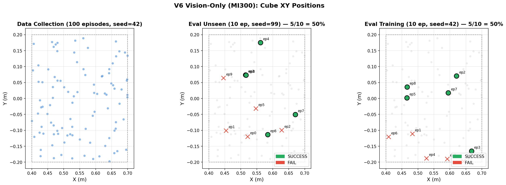

# Robot Synthetic Data Generation Workshop

End-to-end pipeline for robot manipulation: **Synthetic Data Generation → VLA Training → Simulation Evaluation**.

## Pipeline Overview

```
┌─────────────────────┐     ┌─────────────────────┐     ┌─────────────────────┐
│  01_gen_data.py      │     │  02_train_vla.py     │     │  03_eval.py          │
│                      │     │                      │     │                      │
│  Genesis simulation  │────▶│  SmolVLA fine-tune   │────▶│  Closed-loop eval    │
│  IK trajectory plan  │     │  on LeRobot dataset  │     │  in Genesis sim      │
│  LeRobot dataset out │     │  HF checkpoint out   │     │  success rate + video│
└─────────────────────┘     └─────────────────────┘     └─────────────────────┘
     Franka 7-DOF                lerobot/smolvla_base         render → VLA → PD
     pick red cube               freeze vision encoder        action chunking
     2 cameras (up/side)         train expert + state_proj    randomized cube pos
```

## File Structure

```
robot_synthetic_data_generation_workshop/
├── README.md               ← this file
├── run_pipeline.sh         ← one-click end-to-end pipeline
└── scripts/
    ├── 01_gen_data.py      ← Step 1: Franka pick-cube data generation (Genesis)
    ├── 02_train_vla.py     ← Step 2: SmolVLA post-training on collected data
    ├── 03_eval.py          ← Step 3: closed-loop simulation evaluation
```


## Prerequisites

### Software

| Package | Version | Purpose |
|---|---|---|
| `genesis-world` | ≥0.4.1 | Physics simulation + rendering |
| `lerobot` | ≥0.4.4 | Dataset format + SmolVLA model |
| `torch` | ≥2.1 | Training & inference |
| `transformers` | ≥4.40 | SmolVLA backbone (Idefics3) |
| `accelerate` | latest | HF model loading |
| `safetensors` | latest | Model checkpoint I/O |
| `matplotlib` | ≥3.5 | Loss curve plot (optional) |

### Hardware

- **GPU**: ≥4 GB VRAM (tested: NV RTX 4090, AMD MI300)
- **Display**: Xvfb on headless Linux (auto-started by scripts)

### Docker (recommended)

```bash
docker run --rm \
  --device=/dev/kfd --device=/dev/dri --group-add video --ipc=host \
  -e PYOPENGL_PLATFORM=egl \
  -v $(pwd):/workspace/workshop \
  -v ~/outputs:/output \
  -v ~/.hf_cache:/root/.cache/huggingface \
  -w /workspace/workshop \
  <genesis-lerobot-image> \
  bash run_pipeline.sh
```

## Quick Start

### One-click pipeline

```bash
bash run_pipeline.sh              # default: 100 episodes, 2000 training steps
bash run_pipeline.sh 50 1000      # 50 episodes, 1000 steps (faster for testing)
```

### Step-by-step

#### Step 1: Synthetic Data Generation

Generate Franka pick-cube trajectories with IK planning in Genesis:

```bash
python scripts/01_gen_data.py \
  --n-episodes 100 \
  --repo-id local/franka-workshop \
  --save /output \
  --seed 42
```

- **Robot**: Franka Panda 7-DOF
- **Task**: Pick up a red cube from randomized XY positions
- **Trajectory**: HOME → hover → descend → grasp → lift (IK-planned)
- **Output**: LeRobot dataset with `observation.state` (9D joints), `action` (9D), `observation.images.up/side` (640×480)
- **Success rate**: ~100% (expert IK trajectories)

Key flags:
- `--add-goal`: append `cube_xy` to state (9D → 11D, for V5 goal-conditioned experiments)
- `--no-videos`: store images as PNG instead of MP4 (faster on mounted volumes)
- `--no-bbox-detection`: AMD GPU workaround

#### Step 2: SmolVLA Post-Training

Fine-tune `lerobot/smolvla_base` on the collected dataset:

```bash
python scripts/02_train_vla.py \
  --dataset-id local/franka-workshop \
  --n-steps 2000 \
  --batch-size 4 \
  --num-workers 0 \
  --save-dir /output/outputs/workshop_smolvla
```

- **Base model**: `lerobot/smolvla_base` (~450M params)
- **Training**: freeze vision encoder, train expert layers + state projection only
- **Config**: `chunk_size=50`, `n_action_steps=50`, AdamW optimizer
- **Output**: HF-format checkpoint at `<save-dir>/final/`

Key flags:
- `--num-workers 0`: recommended to avoid video decoder crashes on ROCm

#### Step 3: Simulation Evaluation

Closed-loop evaluation: render → SmolVLA → execute action → repeat:

```bash
# Unseen positions (OOD test)
python scripts/03_eval.py \
  --policy-type smolvla \
  --checkpoint /output/outputs/workshop_smolvla/final \
  --dataset-id local/franka-workshop \
  --n-episodes 10 --max-steps 150 --seed 99 \
  --record-video \
  --save /output/eval_unseen

# Training positions (IID test)
python scripts/03_eval.py \
  --policy-type smolvla \
  --checkpoint /output/outputs/workshop_smolvla/final \
  --dataset-id local/franka-workshop \
  --n-episodes 10 --max-steps 150 --seed 42 \
  --record-video \
  --save /output/eval_train
```

- **Loop**: at each step, render up+side cameras → SmolVLA inference → PD control
- **Success**: cube lifted ≥2cm and sustained for ≥8 frames
- **Output**: `eval_summary.json` + per-episode MP4 videos (with `--record-video`)

Key flags:
- `--record-video`: save side/up camera MP4 per episode
- `--action-horizon N`: number of actions to execute before re-planning (default 1)
- `--no-bbox-detection`: AMD GPU workaround


## Results

Verified on **AMD MI300** (ROCm 6.4.3).

### Training

| Metric | Value |
|---|---|
| Training episodes | 100 |
| Steps / batch | 2000 / 4 |
| Loss (start → end) | 0.346 → 0.022 |
| Wall time | ~78 min |
| Peak VRAM | 2.2 GB |

### Evaluation

| Eval set | Success rate |
|---|---|
| Unseen positions (seed=99) | **4/10 = 40%** |
| Training positions (seed=42) | **5/10 = 50%** |

 

## Data Flow

```
Genesis Scene                    LeRobot Dataset                SmolVLA
┌──────────────┐                ┌──────────────┐              ┌──────────────┐
│ Franka Panda │                │ observation   │              │ Vision       │
│ Red Cube     │──IK plan──────▶│  .state [9D]  │──train──────▶│ Encoder      │
│ 2 Cameras    │   joint lerp   │  .images.up   │              │ (frozen)     │
│              │   render       │  .images.side │              │              │
│ Physics sim  │                │ action [9D]   │              │ Expert       │
│ (Genesis)    │                │ task (text)   │              │ Layers       │
└──────────────┘                └──────────────┘              │ (trainable)  │
                                                              │              │
Eval Loop:                                                    │ → action     │
  render ─────────────────────────────────── inference ───────│   chunk [50] │
  observe state ──────────────────────────── predict ─────────│              │
  execute action[0] ──────── PD control ──── scene.step()     └──────────────┘
```

## AMD MI300 Notes

When running on AMD MI300 (ROCm), additional flags are required:

```bash
python scripts/01_gen_data.py --no-bbox-detection --no-videos ...
python scripts/02_train_vla.py --num-workers 0 ...
python scripts/03_eval.py --no-bbox-detection ...
```

Also install missing dependencies inside the Docker container:
```bash
pip install transformers accelerate
```
